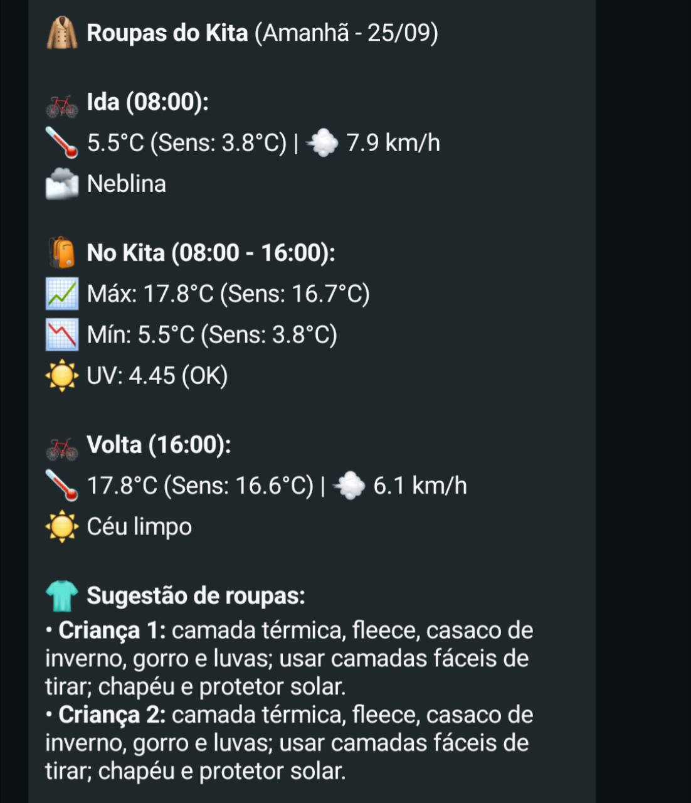

# Weather Checker

Weather Checker sends personalized weather forecasts to multiple households
through CallMeBot. Each household can have its own location, time zone,
children, thermal profiles, recipients, and playground window.

The messages sent by the application are intentionally written in Portuguese
for its current users, while the project documentation and developer-facing
configuration are maintained in English.

## Example weather report

The report combines commute conditions, the daily temperature range, UV
exposure, weather conditions, and child-specific clothing recommendations in a
single WhatsApp message.

<p align="center">
  
</p>

## Household configuration

Copy `households.example.json` to `households.json` and customize the data. The
real configuration file is ignored by Git. Then run:

```bash
export HOUSEHOLDS_CONFIG_PATH=households.json
python3 weatherChecker.py --mode morning
```

You can also provide the complete JSON document through
`HOUSEHOLDS_CONFIG_JSON`. In GitHub Actions, create a repository secret with
that name.

Each entry in `recipients` uses a numeric slot. Credentials can come from
`PHONE_<slot>` and `APIKEY_<slot>`, or from the `phone` and `apikey` fields in a
private configuration file or secret. Environment variables take precedence.

```json
"recipients": {
  "1": {"household": "family_1"},
  "4": {
    "household": "another_family",
    "phone": "+49000000000",
    "apikey": "callmebot-key"
  }
}
```

By default, a recipient receives recommendations for every child in their
household. To select only specific children:

```json
"4": {
  "household": "family_1",
  "children": ["child_2"]
}
```

Supported thermal profiles:

- `cold_sensitive`: selects approximately one warmer clothing range;
- `neutral`: uses the forecast apparent temperature;
- `warm_sensitive`: selects approximately one lighter clothing range.

If neither `HOUSEHOLDS_CONFIG_PATH` nor `HOUSEHOLDS_CONFIG_JSON` is set, the
default configuration keeps slots 1 and 2 in the primary household and slot 3
in an independent household, all using central Munich as the default location.

## Local execution with Docker

1. Copy `households.example.json` to `households.json` and customize the
   households, children, and recipients.
2. Copy `.env.example` to `.env` and fill in the CallMeBot credentials.
3. Preview all messages without sending them:

```bash
HOUSEHOLDS_CONFIG_FILE=./households.json docker compose run --rm \
  weather-checker python weatherChecker.py --mode morning --dry-run
HOUSEHOLDS_CONFIG_FILE=./households.json docker compose run --rm \
  weather-checker python weatherChecker.py --mode night --dry-run
```

4. After reviewing the messages, start the scheduler:

```bash
HOUSEHOLDS_CONFIG_FILE=./households.json docker compose up -d --build
docker compose logs -f weather-checker
```

The process schedules reports every day at **07:00** and **20:00** in the
`Europe/Berlin` time zone. The schedule remains aligned with local time across
daylight-saving changes. Jobs delayed by up to 30 minutes are coalesced and run
once, and concurrent executions are prevented.

If a weather request or message delivery fails, the execution exits with an
error and the container health check remains `unhealthy` until a complete run
succeeds. Before the first scheduled run, the container is considered healthy.

To stop the service without deleting its configuration:

```bash
docker compose down
```

The GitHub operational workflow is available only for manual contingency runs.
Requests sent by external cron services no longer start reports, preventing
duplicate messages alongside the local scheduler.

## Continuous integration

The `CI` workflow runs on every push and pull request. It executes the complete
test suite, validates the Docker Compose configuration, and builds the Docker
image.

## Tests

```bash
python -m pip install -r requirements-dev.txt
pytest -q
```
